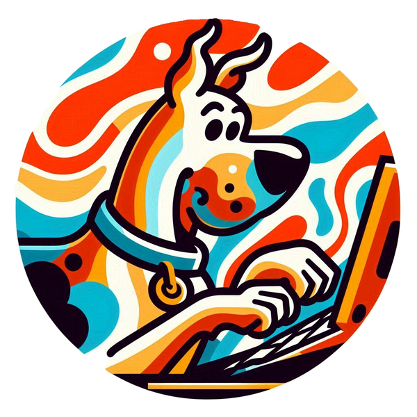
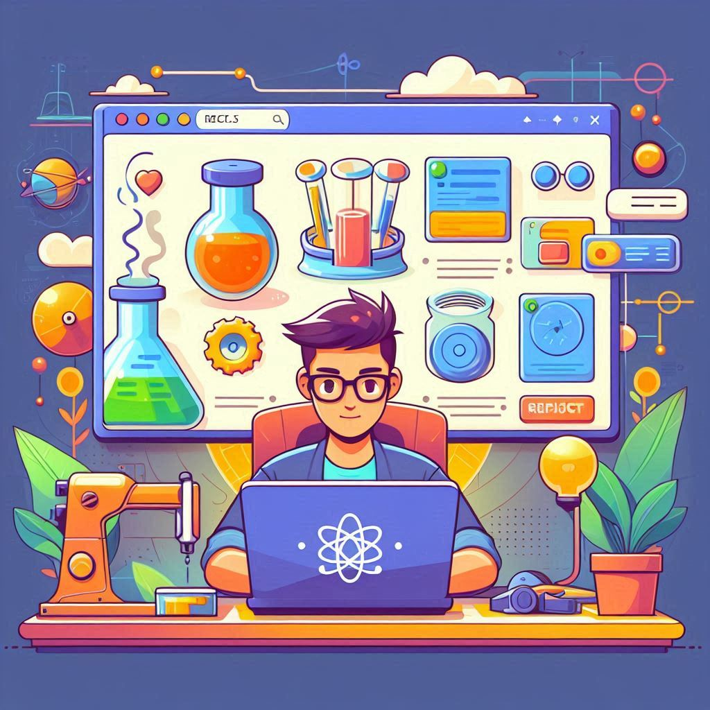

# Greetings

Hi 👋 Nice to meet you!

## Summary

I love building software, exploring new ideas, and seeing them come to life. I have a passion for sharing my knowledge and helping others learn software development as well.

## Hire Me

  

### Do you want to **hire me** as a Software Engineer? Please send me a message on [LinkedIn](https://www.linkedin.com/in/renanengineer/).

## Projects

I maintain [Tech World Software School](https://www.nbktechworld.com) and [Mundo Tech Software School](https://www.nbkmundotech.com).

Enroll in one of [my Udemy courses](https://www.udemy.com/user/renan-martins-5/).

.  
.  
.  
.  

## Support Me

### Support my work with a **[donation/tip](https://linktr.ee/nbktechworld)**

